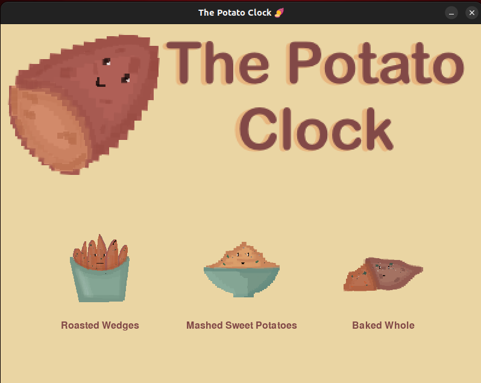
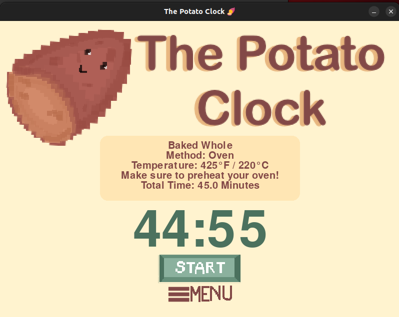

<h1>
  
  The Potato Clock
</h1>


Welcome to **The Potato Clock**, your cozy kitchen companion for cooking sweet potatoes *just right*. Whether you’re roasting wedges, mashing them up, or baking them whole, this adorable timer will keep track while you relax. ⏲️

I made this app out of my love for sweet potatoes. They’re cozy, versatile, and full of flavor. I cook them very often, but I always forget how long each of my favorite methods takes.
That little hiccup inspired me to build a warm and playful timer just for sweet potatoes.💛

---

## 📋 What It Does

This Pygame-powered app lets you:

- Choose how you'd like to cook your sweet potato (roasted, mashed, baked)
- View the method and temperature instructions
- Start a timer tailored to that cooking method
- Get a **gentle ding** when time is up!

All wrapped in a warm, playful design with custom buttons and icons 💫

---

## 🖼️ Preview

| Menu Screen | Timer Screen |
|-------------|--------------|
|  |  |

---

## 🚀 How to Run
### Run Locally with Python

#### Requirements:
- Python 3.8+
- `pygame`

#### Setup:

```bash
git clone https://github.com/YOUR_USERNAME/The-Potato-Clock.git
cd The-Potato-Clock
pip install -r requirements.txt
python main.py
